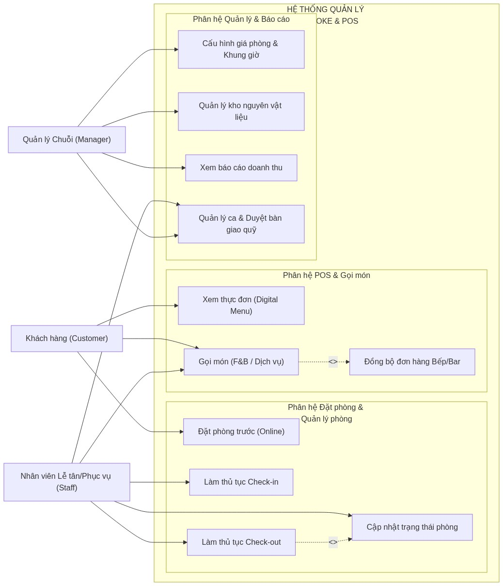
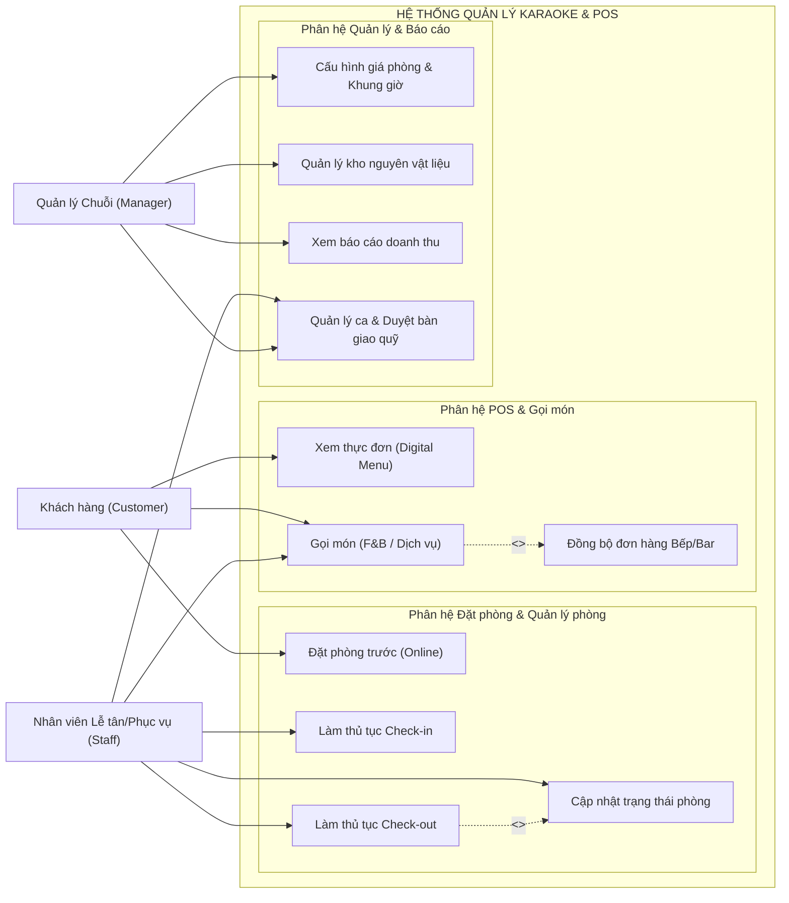
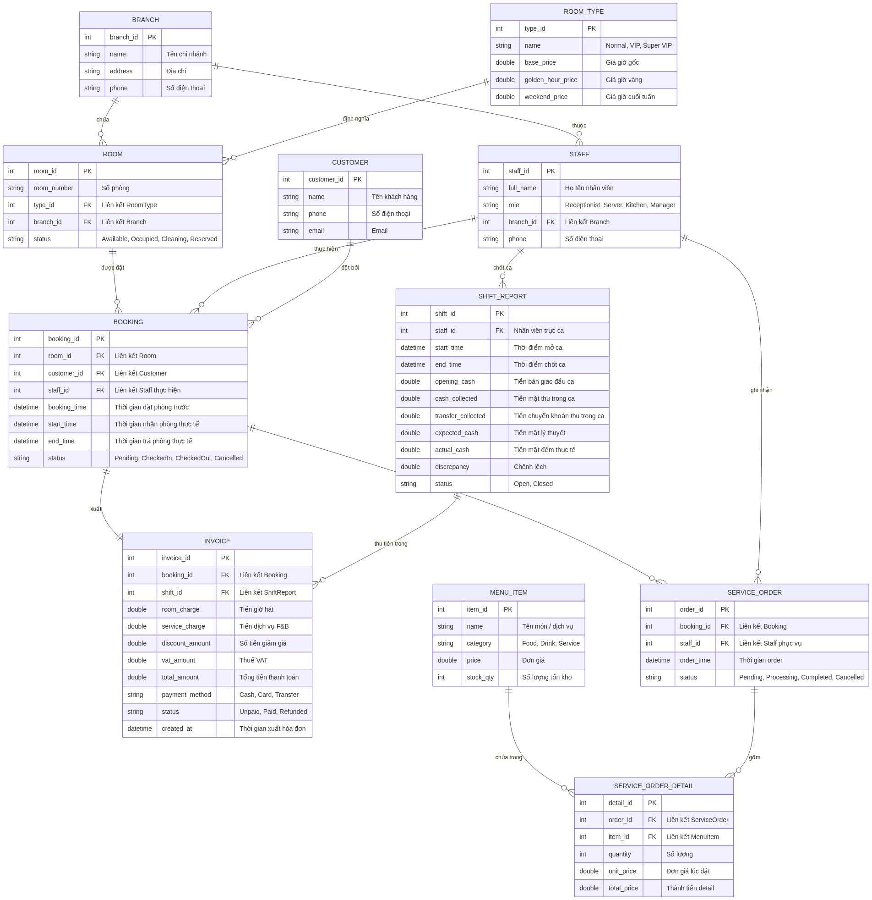
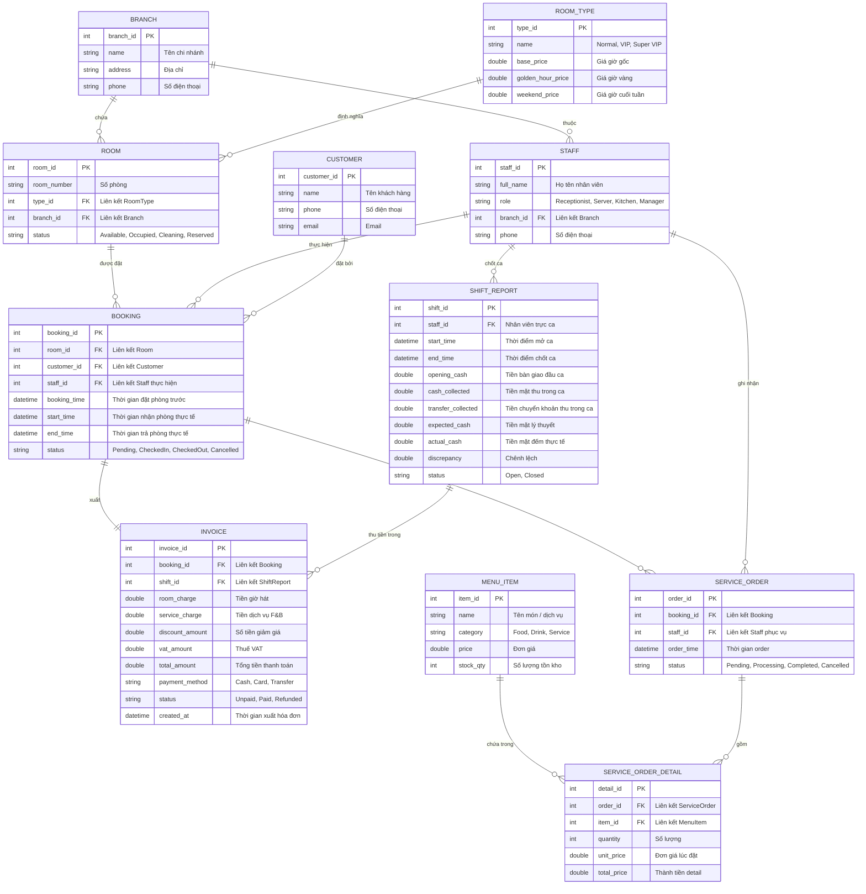

# TÀI LIỆU ĐẶC TẢ YÊU CẦU PHẦN MỀM (SRS)
## HỆ THỐNG QUẢN LÝ CHUỖI PHÒNG HÁT KARAOKE & POS (KARAOKE CHAIN MANAGEMENT & POS SYSTEM)

**Phiên bản:** 1.0  
**Tác giả:** IT Consultant & System Analyst  
**Ngày phát hành:** 17/07/2026  
**Dự án:** Hệ thống Quản lý Chuỗi Phòng hát Karaoke (Karaoke Booking & POS)

---

## MỤC LỤC
1. [GIỚI THIỆU CHUNG & TỔNG QUAN HỆ THỐNG](#1-giới-thiệu-chung--tổng-quan-hệ-thống)
   - 1.1. Mục tiêu dự án
   - 1.2. Phạm vi dự án
   - 1.3. Các phân hệ cốt lõi (Modules)
   - 1.4. Đối tượng người dùng (Actors)
2. [ĐẶC TẢ YÊU CẦU NGHIỆP VỤ & USER STORIES](#2-đặc-tả-yêu-cầu-nghiệp-vụ--user-stories)
   - 2.1. Phân hệ Đặt phòng & Quản lý Trạng thái Phòng
   - 2.2. Phân hệ Gọi món & POS tại quầy
   - 2.3. Phân hệ Quản lý Chuỗi & Báo cáo Doanh thu
   - 2.4. Danh sách User Stories chi tiết
3. [THIẾT KẾ SƠ ĐỒ HỆ THỐNG (SYSTEM DIAGRAMS)](#3-thiết- kế-sơ-đồ-hệ-thống-system-diagrams)
   - 3.1. Sơ đồ Use Case (Use Case Diagram)
   - 3.2. Sơ đồ Thực thể Mối quan hệ (Entity Relationship Diagram - ERD)
4. [THIẾT KẾ RESTFUL APIS CHÍNH](#4-thiết-kế-restful-apis-chính)
   - 4.1. Nhóm API Quản lý Phòng & Đặt phòng
   - 4.2. Nhóm API Gọi món & Dịch vụ (POS)
   - 4.3. Nhóm API Báo cáo & Doanh thu
5. [YÊU CẦU PHI CHỨC NĂNG (NON-FUNCTIONAL REQUIREMENTS)](#5-yêu-cầu-phi-chức-năng-non-functional-requirements)
   - 5.1. Hiệu năng & Khả năng mở rộng
   - 5.2. Tính khả dụng & Tin cậy
   - 5.3. Bảo mật & Phân quyền

---

## 1. GIỚI THIỆU CHUNG & TỔNG QUAN HỆ THỐNG

### 1.1. Mục tiêu dự án
Hệ thống Quản lý Chuỗi Phòng hát Karaoke & POS được thiết kế nhằm hiện đại hóa quy trình vận hành của các chuỗi cơ sở karaoke từ đặt phòng, quản lý sơ đồ phòng theo thời gian thực đến tối ưu hóa quy trình POS gọi đồ ăn, thức uống (F&B) trực tiếp tại quầy hoặc tại phòng hát. Hệ thống giúp loại bỏ các thao tác thủ công dễ gây nhầm lẫn về giờ hát, kiểm soát chặt chẽ hàng tồn kho, ngăn ngừa thất thoát tài chính thông qua quy trình bàn giao ca nghiêm ngặt và hỗ trợ đưa ra các báo cáo doanh thu đa chiều cho Ban Quản trị.

### 1.2. Phạm vi dự án
Hệ thống áp dụng cho toàn bộ các chi nhánh trong chuỗi karaoke, cung cấp giải pháp đa nền tảng:
- **Web App dành cho Nhân viên Lễ tân và Quản lý** vận hành tại quầy thu ngân.
- **Mobile/Web App (Responsive) dành cho Khách hàng** đặt phòng trực tuyến hoặc gọi món trực tiếp khi ở trong phòng.
- **Màn hình hiển thị tại khu vực Bếp/Bar** để tiếp nhận order.
- **Hệ thống Backend tập trung** quản lý toàn bộ dữ liệu chuỗi chi nhánh.

### 1.3. Các phân hệ cốt lõi (Modules)
Hệ thống bao gồm 3 phân hệ cốt lõi:
1. **Phân hệ Đặt phòng & Quản lý Trạng thái Phòng (Room Booking & Management):** Theo dõi sơ đồ phòng theo thời gian thực tại các chi nhánh. Hỗ trợ đặt phòng trước, check-in, tự động hóa quy trình check-out và quản lý trạng thái dọn phòng.
2. **Phân hệ Gọi món & POS tại quầy (Ordering & POS):** Quản lý thực đơn điện tử (F&B), thực hiện order món trực tiếp tại phòng hoặc qua nhân viên phục vụ, đồng bộ lập tức xuống bếp/bar. Hỗ trợ thanh toán nhanh chóng, tính toán tiền giờ tự động theo thuật toán làm tròn thời gian và áp dụng các khung giờ giá linh hoạt.
3. **Phân hệ Quản lý Chuỗi & Báo cáo Doanh thu (Chain Management & Analytics):** Quản lý kho hàng (nhập/xuất/tồn kho nguyên vật liệu), quản lý ca làm việc của nhân viên (Shift Management), cấu hình bảng giá phòng/dịch vụ linh động, và hệ thống báo cáo phân tích hiệu suất phòng, doanh thu theo chi nhánh.

### 1.4. Đối tượng người dùng (Actors)
Hệ thống được thiết kế phục vụ tối thiểu 3 đối tượng người dùng chính:
- **Khách hàng (Customer):** Người sử dụng dịch vụ. Có khả năng đặt phòng online qua ứng dụng di động/web, tự quét mã QR tại phòng để xem menu F&B, gọi món, gửi yêu cầu phục vụ và theo dõi hóa đơn tạm tính của mình.
- **Nhân viên Lễ tân / Phục vụ (Staff):** Nhân viên vận hành tại chỗ. Lễ tân thực hiện nhận lịch đặt phòng, check-in cho khách, xếp phòng, in hóa đơn tạm tính và tính tiền check-out. Nhân viên phục vụ hỗ trợ khách gọi món từ thiết bị cầm tay của nhân viên (tablet/mobile POS), giao đồ và hỗ trợ dọn dẹp phòng.
- **Quản lý Cửa hàng / Chuỗi (Manager/Admin):** Người kiểm soát vận hành và cấu hình. Có quyền quản lý ca làm việc, duyệt chốt ca (Shift Report), điều chỉnh menu F&B, cấu hình bảng giá phòng theo giờ thường/giờ vàng/ngày lễ, và truy cập toàn bộ hệ thống báo cáo tài chính của các chi nhánh.

---

## 2. ĐẶC TẢ YÊU CẦU NGHIỆP VỤ & USER STORIES

### 2.1. Phân hệ Đặt phòng & Quản lý Trạng thái Phòng
Phân hệ này giải quyết bài toán quản lý và vận hành phòng hát theo thời gian thực.
*   **Trạng thái Phòng:** Hệ thống quản lý vòng đời trạng thái của từng phòng bao gồm:
    *   `Available` (Trống - Sẵn sàng đón khách)
    *   `Reserved` (Đã đặt trước - Khách đã đặt và chuẩn bị tới nhận phòng)
    *   `Occupied` (Đang hát - Khách đang sử dụng)
    *   `Cleaning` (Đang dọn dẹp - Khách đã check-out, nhân viên đang dọn để chuyển sang Available)
*   **Quy tắc tính tiền giờ phức tạp:**
    *   *Loại phòng:* Phân loại thành 3 hạng phòng với giá cơ bản (Base Rate) khác nhau:
        *   `Normal` (Phòng thường): Sức chứa 5-10 người.
        *   `VIP` (Phòng VIP): Sức chứa 10-20 người, trang bị âm thanh cao cấp.
        *   `Super VIP` (Phòng siêu VIP): Sức chứa trên 20 người, thiết kế sân khấu riêng.
    *   *Hệ số giờ vàng (Golden Hour Pricing):* Áp dụng phụ phí hoặc hệ số nhân cho khung giờ vàng từ **18:00 đến 23:00** hàng ngày. Mức giá trong khung giờ này tăng từ 30% - 50% so với giá cơ sở.
    *   *Hệ số ngày cuối tuần (Weekend Pricing):* Thứ 6, Thứ 7 và Chủ nhật áp dụng biểu giá cuối tuần (Weekend Rate) tăng 20% so với ngày thường (Thứ 2 - Thứ 5).
    *   *Quy tắc làm tròn thời gian hát (Rounding Logic):*
        *   Thời gian hát sử dụng đơn vị Phút.
        *   Dưới 15 phút: Không tính tiền giờ (miễn phí tiền giờ hát nếu khách đổi phòng hoặc ra ngay).
        *   Từ 15 phút đến 45 phút: Tính làm tròn thành **0.5 giờ**.
        *   Trên 45 phút đến dưới 60 phút: Tính làm tròn thành **1.0 giờ**.
        *   Các giờ tiếp theo áp dụng lũy tiến tương tự (ví dụ: 1 giờ 10 phút tính 1.0 giờ; 1 giờ 20 phút tính 1.5 giờ).

### 2.2. Phân hệ Gọi món & POS tại quầy
Phân hệ hỗ trợ tối đa hóa doanh thu từ mảng dịch vụ (F&B) và tối ưu quy trình phục vụ.
*   **Quy trình gọi món thời gian thực (Real-time Service Order):**
    1.  Khách hàng quét mã QR đặt tại phòng để mở Web Menu tự chọn món, hoặc Nhân viên dùng máy tính bảng POS chọn món cho khách.
    2.  Sau khi nhấn "Gửi Order", hệ thống kiểm tra số lượng tồn kho khả dụng của các mặt hàng trong Menu Item. Nếu đủ, tạo yêu cầu gọi món với trạng thái `Pending`.
    3.  Yêu cầu lập tức hiển thị trên màn hình của Bếp/Bar dưới dạng danh sách hàng đợi (Queue) phân loại theo món ăn hoặc đồ uống. Trạng thái chuyển sang `Processing`.
    4.  Khi Bếp/Bar làm xong, bấm xác nhận hoàn thành, trạng thái chuyển sang `Completed`. Đồng thời, hệ thống thông báo cho nhân viên phục vụ qua ứng dụng di động để mang đồ lên phòng.
    5.  Hóa đơn tạm tính của phòng hát tự động cộng gộp giá trị món đồ ăn/thức uống ngay khi Bếp/Bar xác nhận hoàn thành order.
*   **Quy trình Check-out & In hóa đơn:**
    1.  Lễ tân chọn phòng cần check-out trên phần mềm.
    2.  Hệ thống tự động tính toán tổng số phút sử dụng phòng, áp dụng biểu giá giờ theo khung giờ vàng/ngày cuối tuần để tính ra **Tiền giờ hát**.
    3.  Hệ thống tổng hợp tất cả các đơn F&B đã hoàn thành của phòng để tính ra **Tiền dịch vụ**.
    4.  Hệ thống tính thuế VAT (mặc định 10%) và áp dụng mã giảm giá (Discount) nếu có.
    5.  Lễ tân in hóa đơn tạm tính cho khách hàng kiểm tra.
    6.  Khách hàng thanh toán qua Tiền mặt, Thẻ ngân hàng hoặc Chuyển khoản quét QR (Dynamic VietQR mã hóa đúng số tiền cần thanh toán). Sau khi giao dịch thành công, trạng thái hóa đơn đổi thành `Paid` và trạng thái phòng chuyển sang `Cleaning`.

### 2.3. Phân hệ Quản lý Chuỗi & Báo cáo Doanh thu
Phân hệ vận hành ở mức độ quản lý, đảm bảo dòng tiền và hàng hóa minh bạch.
*   **Quản lý ca làm việc & Bàn giao quỹ (Shift Management):**
    *   Mỗi ngày vận hành chia làm các Ca làm việc (Shifts) cố định hoặc linh hoạt cho nhân viên lễ tân thu ngân.
    *   *Bắt đầu ca:* Nhân viên đăng nhập hệ thống, nhập số tiền mặt đầu ca trong két (Opening Cash). Trạng thái ca là `Open`.
    *   *Trong ca:* Tất cả các hóa đơn thanh toán bằng tiền mặt, thẻ hay chuyển khoản đều được ghi nhận gắn với mã ca làm việc (`shift_id`).
    *   *Kết thúc ca:* Nhân viên thực hiện đếm tiền mặt thực tế trong két, nhập số liệu tiền mặt cuối ca (Actual Cash). Hệ thống sẽ so sánh giữa số tiền mặt lý thuyết cần thu (Expected Cash = Opening Cash + Cash Collected) với số tiền thực tế để chỉ ra chênh lệch (Discrepancy). Nhân viên làm báo cáo bàn giao ca (Shift Report) gửi Quản lý phê duyệt. Quản lý duyệt chốt ca sẽ đóng ca làm việc đó (`Closed`).
*   **Quản lý kho nguyên vật liệu:** Tự động trừ kho nguyên vật liệu tương ứng (bia, nước ngọt, đồ ăn đóng chai) ngay sau khi đơn hàng F&B được xác nhận hoàn thành. Cảnh báo khi lượng tồn kho chạm ngưỡng tối thiểu.

### 2.4. Danh sách User Stories chi tiết

| ID | Actor | Phân hệ (Module) | Tên User Story | Nội dung User Story |
| :--- | :--- | :--- | :--- | :--- |
| **US-01** | Khách hàng | Đặt & QL Phòng | Đặt phòng online | Là một khách hàng, tôi muốn đặt phòng hát trước thông qua ứng dụng di động để đảm bảo có phòng trống khi tôi và bạn bè đến. |
| **US-02** | Khách hàng | Gọi món & POS | Gọi món bằng mã QR | Là một khách hàng, tôi muốn quét mã QR tại phòng để tự xem menu và gọi đồ ăn uống mà không cần phải chờ nhân viên đến ghi order. |
| **US-03** | Khách hàng | Gọi món & POS | Xem hóa đơn tạm tính | Là một khách hàng, tôi muốn xem hóa đơn tạm tính thời gian thực trên điện thoại của mình để kiểm soát chi phí của buổi hát. |
| **US-04** | Nhân viên | Đặt & QL Phòng | Quản lý sơ đồ phòng | Là một lễ tân, tôi muốn xem sơ đồ phòng dạng lưới theo thời gian thực để nhanh chóng biết phòng nào trống, phòng nào đang dọn để xếp khách vào. |
| **US-05** | Nhân viên | Đặt & QL Phòng | Check-in nhanh | Là một lễ tân, tôi muốn check-in nhanh cho khách đặt trước hoặc khách vãng lai để ghi nhận thời điểm bắt đầu tính tiền giờ hát. |
| **US-06** | Nhân viên | Gọi món & POS | Đặt đồ cho khách | Là một nhân viên phục vụ phòng, tôi muốn dùng máy tính bảng POS chọn món ăn/thức uống cho khách để gửi nhanh yêu cầu chế biến xuống bếp/bar. |
| **US-07** | Nhân viên | Gọi món & POS | Check-out và in hóa đơn | Là một lễ tân, tôi muốn thực hiện check-out phòng để hệ thống tự động tính tiền giờ hát, in hóa đơn chuẩn xác cho khách thanh toán. |
| **US-08** | Nhân viên | QL Chuỗi & Báo cáo | Bàn giao ca làm việc | Là một lễ tân, tôi muốn làm báo cáo bàn giao ca và tiền mặt thu được cuối ca để quản lý đối chiếu dòng tiền chính xác. |
| **US-09** | Quản lý | QL Chuỗi & Báo cáo | Cấu hình biểu giá giờ | Là một quản lý chuỗi, tôi muốn cấu hình bảng giá phòng theo loại phòng, khung giờ vàng và cuối tuần để tối ưu hóa doanh thu theo thời điểm. |
| **US-10** | Quản lý | QL Chuỗi & Báo cáo | Quản lý kho hàng | Là một quản lý, tôi muốn theo dõi lượng tồn kho của F&B và nhận cảnh báo khi sắp hết hàng để chủ động lên kế hoạch nhập hàng. |
| **US-11** | Quản lý | QL Chuỗi & Báo cáo | Báo cáo doanh thu | Là một quản lý chuỗi, tôi muốn xem báo cáo doanh thu theo chi nhánh, ca làm việc và các biểu đồ phân tích tần suất phòng để đưa ra chiến lược kinh doanh. |

---

## 3. THIẾT KẾ SƠ ĐỒ HỆ THỐNG (SYSTEM DIAGRAMS)

### 3.1. Sơ đồ Use Case (Use Case Diagram)
Dưới đây là sơ đồ Use Case thể hiện ranh giới hệ thống, các Actor chính và các hành vi tương tác được phân loại theo các phân hệ chức năng:



*Mã nguồn sơ đồ Mermaid (Use Case):*


### 3.2. Sơ đồ Thực thể Mối quan hệ (Entity Relationship Diagram - ERD)
Sơ đồ ERD mô tả chi tiết thiết kế cơ sở dữ liệu quan hệ của hệ thống, bao gồm các ràng buộc khóa ngoại, quan hệ 1-N và các bảng trung gian cần thiết cho nghiệp vụ:



*Mã nguồn sơ đồ Mermaid (ERD):*


---

## 4. THIẾT KẾ RESTFUL APIS CHÍNH

Dưới đây là đặc tả chi tiết một số API RESTful chính kết nối hệ thống Frontend và Backend:

### 4.1. Nhóm API Quản lý Phòng & Đặt phòng

#### 1. API Đặt phòng trước (Online Booking)
*   **Method:** `POST`
*   **Path:** `/api/v1/bookings`
*   **Request Body:**
```json
{
  "customer_id": 102,
  "branch_id": 1,
  "room_type_id": 2,
  "booking_time": "2026-07-17T19:30:00Z",
  "phone": "0987654321"
}
```
*   **Response Body (Status 201 Created):**
```json
{
  "booking_id": 1502,
  "room_id": null,
  "customer_id": 102,
  "booking_time": "2026-07-17T19:30:00Z",
  "status": "Pending",
  "message": "Đặt phòng thành công. Hệ thống sẽ giữ chỗ trước 15 phút so với giờ hẹn."
}
```

#### 2. API Check-in phòng (Nhận phòng thực tế)
*   **Method:** `POST`
*   **Path:** `/api/v1/bookings/{booking_id}/check-in`
*   **Request Body:**
```json
{
  "room_id": 15,
  "staff_id": 8
}
```
*   **Response Body (Status 200 OK):**
```json
{
  "booking_id": 1502,
  "room_id": 15,
  "start_time": "2026-07-17T19:25:10Z",
  "status": "CheckedIn",
  "room_status": "Occupied"
}
```

---

### 4.2. Nhóm API Gọi món & Dịch vụ (POS)

#### 1. API Gửi Đơn Gọi Món (Service Order)
*   **Method:** `POST`
*   **Path:** `/api/v1/orders`
*   **Request Body:**
```json
{
  "booking_id": 1502,
  "staff_id": 8,
  "items": [
    {
      "item_id": 5,
      "quantity": 10
    },
    {
      "item_id": 12,
      "quantity": 2
    }
  ]
}
```
*   **Response Body (Status 201 Created):**
```json
{
  "order_id": 8809,
  "booking_id": 1502,
  "order_time": "2026-07-17T19:40:00Z",
  "status": "Pending",
  "total_items": 2
}
```

#### 2. API Cập nhật trạng thái Bếp/Bar (Processing/Completed)
*   **Method:** `PATCH`
*   **Path:** `/api/v1/orders/{order_id}/status`
*   **Request Body:**
```json
{
  "status": "Completed",
  "staff_id": 12
}
```
*   **Response Body (Status 200 OK):**
```json
{
  "order_id": 8809,
  "status": "Completed",
  "updated_at": "2026-07-17T19:48:15Z"
}
```

---

### 4.3. Nhóm API Báo cáo & Doanh thu

#### 1. API Đóng ca làm việc và Bàn giao quỹ (Close Shift)
*   **Method:** `POST`
*   **Path:** `/api/v1/shifts/{shift_id}/close`
*   **Request Body:**
```json
{
  "actual_cash": 12450000.00
}
```
*   **Response Body (Status 200 OK):**
```json
{
  "shift_id": 301,
  "staff_id": 8,
  "opening_cash": 2000000.00,
  "cash_collected": 10500000.00,
  "transfer_collected": 8700000.00,
  "expected_cash": 12500000.00,
  "actual_cash": 12450000.00,
  "discrepancy": -50000.00,
  "status": "Closed",
  "message": "Ca làm việc đã được đóng. Chênh lệch âm 50,000 VND được ghi nhận để kiểm duyệt."
}
```

---

## 5. YÊU CẦU PHI CHỨC NĂNG (NON-FUNCTIONAL REQUIREMENTS)

### 5.1. Hiệu năng & Khả năng mở rộng (Performance & Scalability)
- **Thời gian phản hồi (Response Time):** Các API phục vụ tác vụ đặt món (POS) và truy xuất sơ đồ phòng thời gian thực phải có thời gian phản hồi (Latency) dưới **2 giây** trong điều kiện hoạt động bình thường và dưới **3 giây** khi chịu tải đỉnh.
- **Đồng bộ thời gian thực (Real-time Sync):** Hệ thống thông báo giữa Client (quét mã QR phòng), Lễ tân và Bếp phải được thực hiện thông qua kết nối Socket (WebSocket/gRPC) với độ trễ truyền tin dưới **500ms**.
- **Khả năng chịu tải (Concurrency):** Hệ thống có khả năng chịu tải đồng thời tối thiểu **10,000 người dùng hoạt động đồng thời (Active Users)** trên toàn chuỗi mà không gặp hiện tượng nghẽn mạng hay treo DB.

### 5.2. Tính khả dụng & Tin cậy (Availability & Reliability)
- **Mức độ sẵn sàng (Uptime):** Cam kết tỷ lệ uptime tối thiểu của hệ thống backend là **99.9%** (tương đương thời gian ngừng hoạt động tối đa không quá 8.76 giờ một năm).
- **Sao lưu dữ liệu (Database Backup):** Dữ liệu hóa đơn, tồn kho và ca làm việc phải được sao lưu tự động (Auto-backup) hàng ngày vào lúc 03:00 sáng. Bản sao lưu được lưu trữ trên môi trường Cloud Storage biệt lập.
- **Khôi phục thảm họa (Disaster Recovery):** Thời gian khôi phục tối đa sau sự cố hệ thống (RTO) không quá **30 phút** và lượng dữ liệu tối đa chấp nhận mất mát (RPO) không quá **5 phút** thông qua cấu hình Write-Ahead Log (WAL) của PostgreSQL.

### 5.3. Bảo mật & Phân quyền (Security & Authorization)
- **Xác thực và Phân quyền (Authentication & RBAC):** Sử dụng giao thức **OAuth2 / JSON Web Token (JWT)** để bảo mật giao tiếp API. Phân quyền chặt chẽ dựa trên vai trò (Role-based Access Control) để ngăn chặn Nhân viên truy cập các báo cáo doanh thu chuỗi hoặc tự ý thay đổi cấu hình giá phòng nếu không được cấp quyền.
- **Bảo mật dữ liệu đường truyền:** Toàn bộ dữ liệu trao đổi giữa Frontend và Backend bắt buộc phải được mã hóa thông qua giao thức **HTTPS (TLS 1.3)**.
- **Mã hóa thông tin nhạy cảm:** Số điện thoại của Khách hàng, mật khẩu nhân viên phải được băm (hashing) sử dụng thuật toán **BCrypt** trước khi ghi xuống cơ sở dữ liệu.
